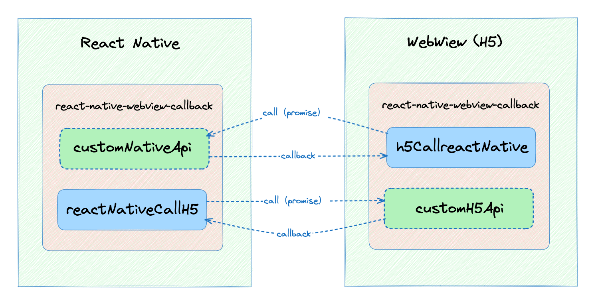

# react-native-webview-callback

[](https://npmjs.org/package/react-native-webview-callback)
[](https://npmjs.org/package/react-native-webview-callback)

A lightweight tool library for connecting React Native and webview, providing communication and success and failure callback methods



## Usage

### Import Dependency Package

```
npm install react-native-webview-callback

```

### Configure and use on H5 end

#### Define your own methods to provide for React Native calls

You can define your own event API and incorporate it during subsequent initialization. eg(myEvent.ts)


``` js
// customH5Api.ts

// Define your own methods to provide for React Native calls
const getWebToken = () => {
  return new Promise((resolve, reject) => {
    try {
      const token = window.localStorage.getItem('token')||'hello';
      resolve(token) // Successful callback
    } catch (error) {
      reject(error)  // Failed callback
    }
  })
};
// other methods

export default {
  getWebToken: getWebToken,
  // other methods
}
```

#### Initialize listening in the entry file && Use and get callback

Initialize listening methods in the entry file

``` js
import { useEffect, useState } from 'react'
import {
  mergeReactNativeApi,
  useReactNativeAddListener,
  reactNativeCallH5,
} from 'react-native-webview-callback';
import myEvent from './customH5Api';
import './App.css';
function App() {
  useH5AddListener(mergeH5Api(myEvent)) // just need init once ,Entry file
  useEffect(() => {
    window.localStorage.setItem('token', 'mytokenStrXXXXX');// mock data
  },[])
  const [result, setResult] = useState('--');
  const testFn = () => {
    h5CallreactNative({
      methodName: "getAppInfo", // Or other interface functions that you customize on the React Native end， eg:“myReactNativeMethod”
      data: "", // Object data can also be passed, and the specific parameter format depends on the defined interface parameters
    })
      .then((data) => {
        if (typeof data === 'object') {
          setResult(JSON.stringify(data))
        } else if (typeof data === 'string') {
          setResult(data)
        }
        console.log("Successful data:", data);
      })
      .catch((error) => {
        alert("Failed from React Native callback");
        console.error("Failed data:", error);
      });
  }
  return (
    <>
      <h1>H5</h1>
      <div className="card">
        <button onClick={testFn}>
          click to getAPPInfo
        </button>
        <p>
          {result}
        </p>
      </div>
    </>
  )
}

export default App

```


### Configure and use on the React Native end

#### Define your own methods to provide for H5 calls

You can define your own event API and incorporate it during subsequent initialization. eg(myEvent.ts)

``` js
// customNativeApi.tsx
import {
  Platform,
  // Share,
} from 'react-native';
// Define your own methods to provide for H5 calls
const getAppInfo = () => {
  return new Promise((resolve, reject) => {
    try {
      const result = {
        os: Platform.OS,
        version: Platform.Version,
      };
      resolve(result); // Successful callback
    } catch (error) {
      reject(error); // Failed callback
    }
  });
};
// other methods
// const appShare = () => {
//   return new Promise((resolve, reject) => {
//     Share.share({
//       message:
//         'React Native | A framework for building native apps using React',
//     }).then(result => {
//       resolve(result); // Successful callback
//     }).catch(error => {
//       reject(error); // Failed callback
//     })
//   });
// };

export default {
  getAppInfo: getAppInfo,
  // other methods
};
```


#### Initialize listening in the entry file & Use and get callback

``` js
// App.tsx

import React, {useRef} from 'react';
import {
  SafeAreaView,
  ScrollView,
  Alert,
  StyleSheet,
  Text,
  useColorScheme,
  View,
} from 'react-native';
import {WebView} from 'react-native-webview';
import myEvent from './customNativeApi';
import {
  mergeReactNativeApi,
  useReactNativeAddListener,
  reactNativeCallH5
}  from 'react-native-webview-callback';
const {alert} = Alert;

function App(): JSX.Element {
  const webViewRef: any = useRef(null);
  // 收到消息
  const onMessage = (event: any) => {
    // eslint-disable-next-line react-hooks/rules-of-hooks
    useReactNativeAddListener({
      bridgeReactNativeApi: mergeReactNativeApi(myEvent), // Merge into custom methods on listening objects
      webViewRef,
      event,
    });
  };
  const handleLoadEnd = () => {
    reactNativeCallH5({
      dataParms: {
        methodName: 'getWebToken', //
        data: '',
      },
      webViewRef: webViewRef,
    })
      .then((data: any) => {
        alert(data || 'Successful data:');
        console.log('Successful data:', data);
      })
      .catch(error => {
        console.log('Failed data:', error);
        alert('Failed from H5 callback');
      });
  };

  return (
    <WebView
      ref={webViewRef}
      source={{
        uri: 'http://192.168.1.121:5173',  // Replace with your IP address
      }}
      originWhitelist={['*']}
      allowFileAccess={true}
      onMessage={onMessage}
      onLoadEnd={handleLoadEnd}
      geolocationEnabled={true}
      allowUniversalAccessFromFileURLs={true}
      useWebKit={true}
    />
  );
}

export default App;

```

## examples
You can take a look at the usage examples in [react-native-webview-callback-demo](https://github.com/liutaohz/react-native-webview-callback-demo) 


## Development

```bash
# install dependencies
$ yarn install

# develop library by docs demo
$ yarn start

# build library source code
$ yarn run build

```

## LICENSE

MIT

Copyright (c) 2023 liutao
